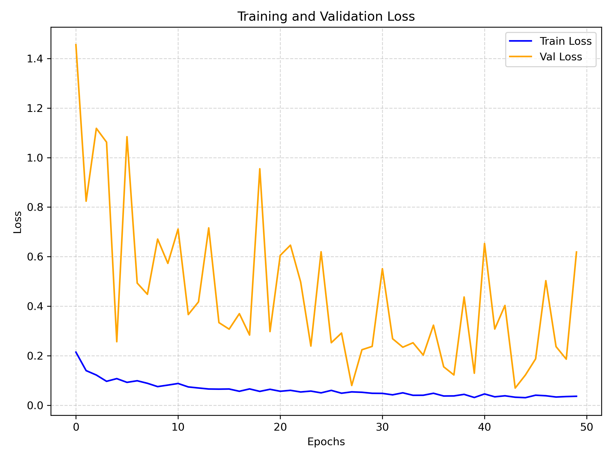
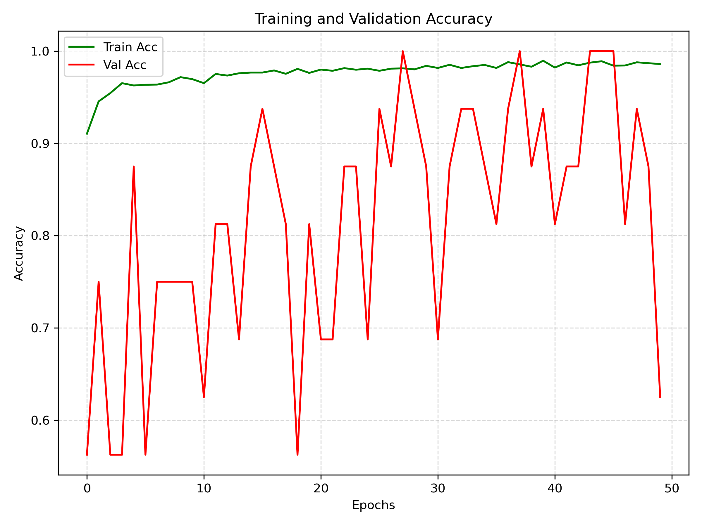
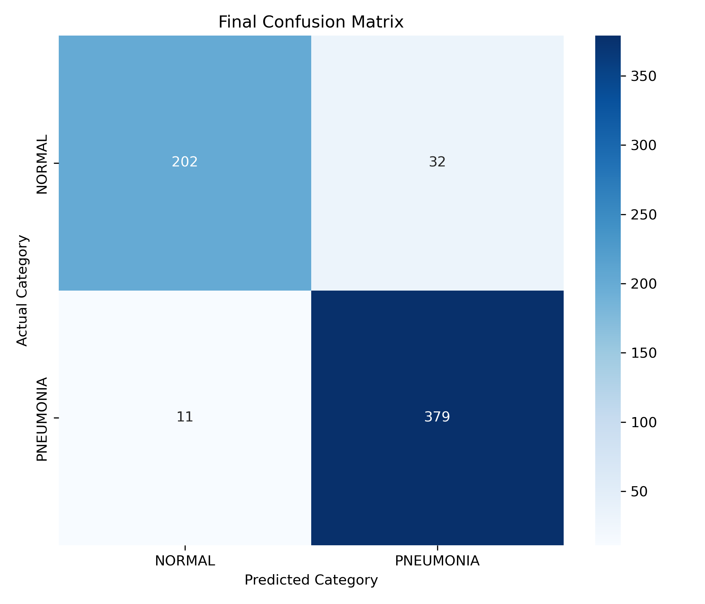
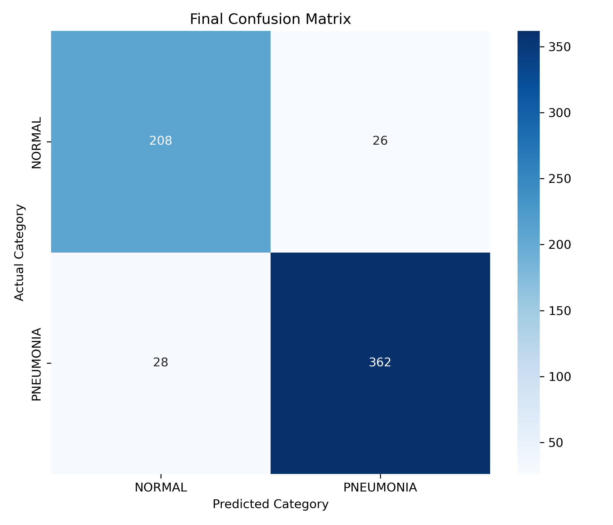
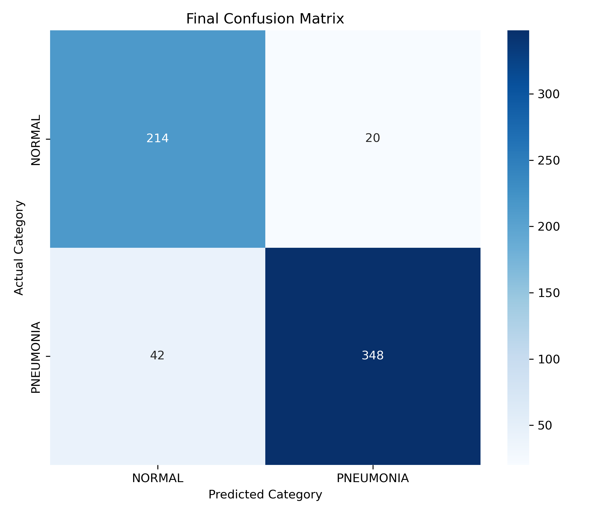
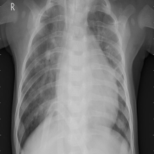
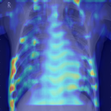
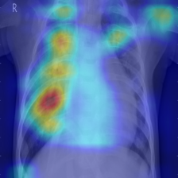
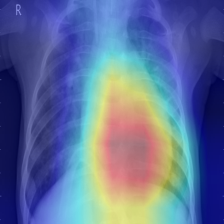
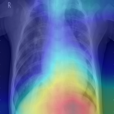

# Chest X-Ray Pneumonia Classification & XAI

## Background
**흉부 X-ray 이미지를 분석하여 정상(Normal)과 폐렴(Pneumonia)을 자동으로 분류하는 딥러닝 모델**을 개발하는 것을 목표로 합니다.
단순한 분류(Classification)를 넘어, 의료 도메인에서의 신뢰성을 확보하기 위해 **Grad-CAM(Gradient-weighted Class Activation Mapping)** 기술을 적용하여 AI의 판단 근거를 시각화(Explainable AI)하였습니다.

Chest X-ray image
        ↓
CNN-based classification
        ↓
Grad-CAM visualization
        ↓
VLM-based textual description

## Dataset
* **Source:** [Kaggle Chest X-Ray Images (Pneumonia)](https://www.kaggle.com/datasets/paultimothymooney/chest-xray-pneumonia)
* **Classes:** `0: Normal` (정상) / `1: Pneumonia` (폐렴)
* **Data Distribution:** 폐렴 데이터가 상대적으로 많은 불균형(Imbalanced) 데이터셋입니다.

| Dataset | Normal (0) | Pneumonia (1) | Total |
| :--- | :---: | :---: | :---: |
| **Train** | 1,341 | 3,875 | 5,216 |
| **Validation** | 8 | 8 | 16 |
| **Test** | 234 | 390 | 624 |

## Models Implemented
각기 다른 깊이와 특징을 가진 4가지의 CNN 기반 아키텍처를 직접 구현하고 성능을 비교 분석했습니다.
1. **SimpleNet** ([Code](models/SimpleNet.py)): 기본적인 Conv-Pool 구조를 가진 가벼운 베이스라인 모델
2. **[VGGNet](models/structure/VGGNet.png)** ([Code](models/VGGNet.py)): 3x3 필터를 깊게 쌓아 미세한 병변 특징을 추출하는 모델 (Custom 10-Layer)
3. **[ResNet](models/structure/ResNet.png)** ([Code](models/ResNet.py)): Skip Connection을 활용하여 기울기 소실 문제를 해결한 모델 (ResNet-18 구조)
4. **[MobileNet](models/structure/MobileNet.png)** ([Code](models/MobileNet.py)): Depthwise Separable Convolution을 적용하여 파라미터 수와 연산량을 획기적으로 줄인 경량화 모델

---

## Performance & Results

### Training Setup

* **Epochs:** 50
* **Learning Rate:** 1e-4 (0.0001)
* **Batch Size:** 32
* **Optimizer:** Adam
* **Loss Function:** CrossEntropyLoss

### Quantitative Evaluation (Test Metrics)

| Model | Accuracy | Precision | Recall | Specificity | F1-Score |
| :--- | :---: | :---: | :---: | :---: | :---: |
| **SimpleNet** | 0.9006 | **0.9457** | 0.8923 | **0.9145** | 0.9182 |
| **VGGNet** | **0.9311** | 0.9201 | **0.9744** | 0.8590 | **0.9465** |
| **ResNet** | **0.9311** | 0.9221 | 0.9718 | 0.8632 | 0.9463 |
| **MobileNet** | 0.9135 | 0.9330 | 0.9282 | 0.8889 | 0.9306 |

> **Analysis** > VGGNet과 ResNet이 93% 이상의 높은 정확도와 F1-Score를 기록하며 우수한 성능을 보였습니다. 특히 VGGNet은 실제 폐렴 환자를 찾아내는 재현율(Recall)이 97.4%로 가장 높았으며, SimpleNet은 파라미터가 적음에도 불구하고 가장 높은 정밀도(Precision)를 보여주었습니다.

---

### Learning Curves (Loss & Accuracy)
ResNet Loss & Accuracy graph

<div align="center">
  
  
</div>

---

### Confusion Matrix

<div align="center">
  <table>
    <tr>
      <td align="center"><b>VGGNet</b></td>
      <td align="center"><b>ResNet</b></td>
    </tr>
    <tr>
      <td></td>
      <td></td>
    </tr>
    <tr>
      <td align="center"><b>MobileNet</b></td>
      <td align="center"><b>SimpleNet</b></td>
    </tr>
    <tr>
      <td></td>
      <td></td>
    </tr>
  </table>
</div>

---

### Explainable AI (Grad-CAM)
> **Visualization Insight** > 시각적 분석 결과, **ResNet**이 모델 중 병변 부위를 가장 정확하고 선명하게 Focusing하여 임상적으로 가장 높은 신뢰도의 판단 근거를 확인하였습니다.

<div align="center"> 
  <table>
    <tr>
      <td align="center"><b>Original Input</b></td>  
      <td align="center"><b>SimpleNet</b></td>  
      <td align="center"><b>VGGNet</b></td>
      <td align="center"><b>ResNet</b></td>
      <td align="center"><b>MobileNet</b></td>
    </tr>
    <tr>
      <td></td> 
      <td></td>  
      <td></td>
      <td></td>
      <td></td>
    </tr>
  </table>
</div>

---

### Vision-Language Model (VLM) Analysis

CNN 기반 분류와 Grad-CAM 시각화에 더해,  **Moondream2**를 활용한 VLM 기반 정성적 영상 설명 모듈을 포함하였습니다.

이 모듈의 목적은 최종 질병 분류를 수행하는 것이 아니라, 폐렴과 관련될 수 있는 흉부 X-ray 영상 내 시각적 소견을 자연어로 설명하는 데 있습니다. 이를 통해 영상 입력과 텍스트 설명을 연결하여, 모델 해석을 보조하는 추가적인 설명 가능성 요소를 제공합니다.

#### VLM Setup

* **Model:** `vikhyatk/moondream2`
* **Revision:** `2025-06-21`
* **Input:** Chest X-ray image (`analysis/Original.png`)
* **Prompt Type:** Medical image description prompt
* **Output:** Textual description of visible findings

#### VLM output
The chest X-ray reveals a clear, symmetrical view of the ribcage, lungs, and heart. The lungs appear somewhat compressed, possibly due to pneumonia. The heart is positioned centrally in the image. The overall appearance is consistent with typical chest X-ray findings.

---

## \Tech Stack & Environment
* **Language:** Python 3.10.0
* **Deep Learning Framework:** PyTorch 2.5.1, Torchvision
* **Image Processing:** OpenCV, PIL
* **Data Visualization:** Matplotlib, Seaborn
* **Environment:** CUDA 12.1 (GPU Acceleration)

## Repository Structure
```text
Chest-x-ray/
├── configs/
│   └── config.py          # 하이퍼파라미터 및 경로 설정 파일
├── models/
│   ├── SimpleNet.py       # 베이스라인 모델
│   ├── VGGNet.py          # Custom VGG (10-Layer)
│   ├── ResNet.py          # Custom ResNet (Skip-Connection)
│   └── MobileNet.py       # Custom MobileNet (Depthwise Separable Conv)
├── src/
│   ├── dataset.py         # 데이터 증강 및 정규화
│   ├── engine.py          # 학습(Train) 및 검증(Validate) 루프
│   ├── gradcam.py         # XAI
│   ├── visualizer.py      # 결과 시각화 
│   └── utils.py           # 평가 지표 
├── main.py                # 모델 학습 실행 
└── predict.py             # 모델 평가 
└── VLM.py                 # 흉부 X-ray 자연어 설명 생성
